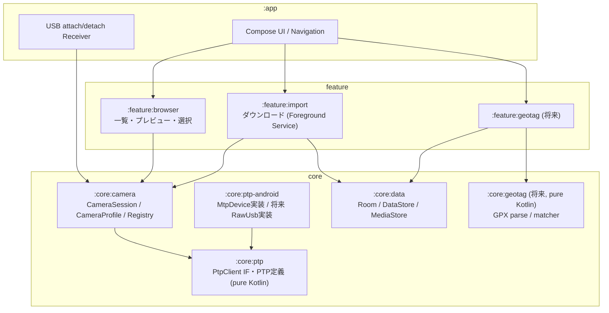
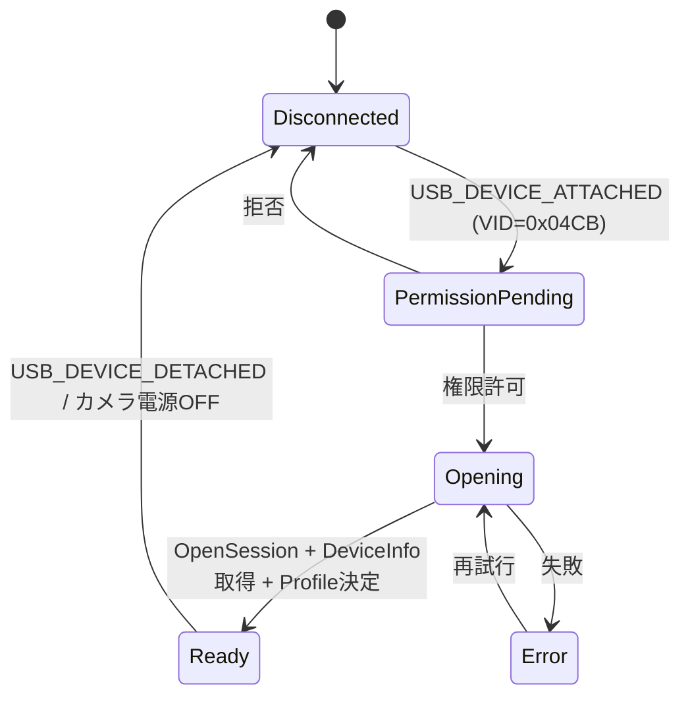
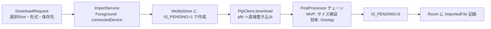
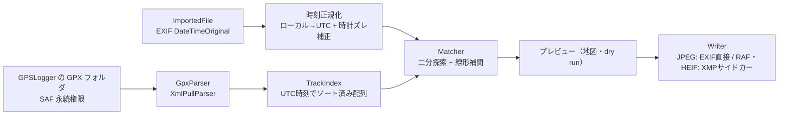

# fuji-ptp-organizer 設計ドキュメント (v0.2)

Fujifilm のカメラを Android 端末と USB 接続し、PTP で SD カード内の写真を閲覧・取り込みするアプリ。

## 1. スコープ

| 区分 | 内容 |
|---|---|
| **MVP** | USB(PTP) 接続 / SD カード内の写真一覧（サムネイル）/ プレビュー / 複数選択して端末ローカルへダウンロード |
| **将来** | GPSLogger の GPX と撮影時刻を突き合わせてジオタグ付与 |
| **対応機種** | X100VI のみ想定。ただし機種差分は `CameraProfile` に閉じ込め、追加機種はプロファイル追加で対応する |
| **対象外 (当面)** | Wi-Fi/Bluetooth 接続、テザー撮影、カメラ内 RAW 現像、カメラへの書き込み・削除 |

## 2. 技術スタック

| 項目 | 採用 | 理由 |
|---|---|---|
| 言語 | Kotlin 2.x | 指定 |
| UI | Jetpack Compose + Material 3 | |
| 非同期 | Coroutines / Flow | PTP は直列実行が前提なので Mutex/専用 Dispatcher で制御しやすい |
| DI | Hilt | M0 は手動 DI（`AppContainer`）。画面が増える M1 で導入する |
| 画像読込 | Coil 3 (カスタム Fetcher) | カメラ上のサムネイルを通常の画像と同じ仕組みでキャッシュ |
| 永続化 | Room (取込履歴・将来のジオタグ状態), DataStore (設定) | |
| USB/PTP | `android.mtp.MtpDevice`（MVP） → 必要になれば自前 PTP 実装 | §4 参照 |
| minSdk / targetSdk | 29 / 最新 | Scoped Storage 前提に揃えて分岐を減らす |

## 3. 全体アーキテクチャ



- `:core:ptp` と `:core:geotag` は Android 非依存にして JVM ユニットテストで固める。
- UI 層は `PtpClient` を直接触らず、`CameraSession` が公開する Flow/suspend 関数だけを使う。

## 4. USB / PTP 層

### 4.1 トランスポートの選択

`PtpClient` インターフェースを自前で定義し、実装を差し替え可能にする。

```kotlin
interface PtpClient : Closeable {
    suspend fun deviceInfo(): PtpDeviceInfo
    suspend fun storageIds(): List<StorageId>
    suspend fun storageInfo(id: StorageId): PtpStorageInfo
    suspend fun objectHandles(storage: StorageId, format: Int? = null, parent: ObjectHandle? = null): List<ObjectHandle>
    suspend fun objectInfo(handle: ObjectHandle): PtpObjectInfo
    suspend fun thumbnail(handle: ObjectHandle): ByteArray
    /** sink へストリーム書き込み。chunk 対応時は progress が細かく呼ばれる */
    suspend fun download(handle: ObjectHandle, sink: ParcelFileDescriptor, onProgress: (Long, Long) -> Unit)
    suspend fun partial(handle: ObjectHandle, offset: Long, size: Int): ByteArray   // 対応時のみ
    val events: Flow<PtpEvent>   // ObjectAdded / StoreRemoved など
}
```

| 実装 | 中身 | 用途 |
|---|---|---|
| `FrameworkPtpClient` (MVP) | `android.mtp.MtpDevice` をラップ。`getObjectHandles` / `getObjectInfo` / `getThumbnail` / `importFile(handle, pfd)` / `getPartialObject` / `readEvent` | 標準 PTP オペレーションで足りる範囲すべて |
| `RawUsbPtpClient` (将来) | `UsbDeviceConnection.bulkTransfer` で PTP コンテナ (length/type/code/txId/payload) を自前で組む | Fujifilm ベンダーオペレーション (0x9xxx) が必要になったとき、MtpDevice に不具合があったとき |

MtpDevice は任意オペレーションを送れないので、ベンダー拡張が必要になった時点で Raw 実装を足す。プロファイル側で「この機種はどちらを使うか」を宣言できるようにしておく。

### 4.2 直列化

PTP は 1 セッション 1 トランザクションずつしか流せない。`CameraSession` 内で単一の `Mutex`（または `limitedParallelism(1)` の Dispatcher）を通して全オペレーションを実行する。その上に **優先度付きキュー** を置く。

1. ユーザー操作（プレビュー表示、ダウンロード）
2. 画面に見えているセルのサムネイル
3. バックグラウンドでの ObjectInfo 先読み

スクロールで見えなくなったサムネイル要求はキャンセルする（Coil のリクエストキャンセルがそのまま伝播する形にする）。

### 4.3 接続フロー / 状態遷移



- `AndroidManifest` で `USB_DEVICE_ATTACHED` の intent-filter + `device_filter.xml`（vendor-id `0x04CB` = Fujifilm）を登録し、接続時にアプリを起動できるようにする。
- インターフェースは class 6 (Still Image) / subclass 1 / protocol 1 を探す。
- 切断は `USB_DEVICE_DETACHED` で検知し、進行中のダウンロードは「未完了」として残す。

## 5. CameraProfile（機種ごとの差分）

### 5.1 方針

- **実行時に検出できることは検出する**: `DeviceInfo.operationsSupported` / `imageFormats` を見て、GetPartialObject 対応可否などを判断する。プロファイルに書くのは「検出できないこと」だけにする。
- プロファイルは振る舞いを含むので Kotlin のコードとして持つ（JSON 等の設定ファイルにはしない）。
- 継承で共通化: `GenericPtpProfile` ← `FujifilmProfile` ← `FujifilmX100VIProfile`。

### 5.2 インターフェース案

```kotlin
interface CameraProfile {
    val id: String                          // "fujifilm.x100vi"
    val displayName: String

    /** USB識別子 + DeviceInfo からマッチ度を返す。最大スコアのプロファイルを採用 */
    fun match(usb: UsbIdentity, info: PtpDeviceInfo): Int

    /** 接続手順のガイド（「PC接続モードを USBカードリーダーに」等）。接続待ち画面に出す */
    val connectionGuide: ConnectionGuide

    /** ファイル種別の判定（ベンダー独自の ObjectFormat コード / 拡張子 → MediaKind） */
    fun classify(info: PtpObjectInfo): MediaKind      // JPEG / HEIF / RAW / VIDEO / OTHER

    /** 同一ショットのまとめ方（DSCF0001.JPG + DSCF0001.RAF → 1 Shot） */
    val shotGrouping: ShotGroupingRule

    /** サムネイル・プレビューの取り方 */
    val previewStrategy: PreviewStrategy   // GetThumb / RAF埋め込みJPEGを部分読み など

    /** カメラ時計の扱い（将来のジオタグ用）: EXIF OffsetTime を書くか、TZ の既定値など */
    val clockPolicy: CameraClockPolicy

    /** どのトランスポート実装を使うか */
    val transport: TransportPreference     // FRAMEWORK / RAW_USB

    /** 既知の不具合回避フラグ */
    val quirks: Set<Quirk>
}
```

### 5.3 プロファイル決定の流れ

1. USB attach 時に VID で一次フィルタ（Fujifilm 以外も `GenericPtpProfile` で一応開ける）。
2. OpenSession 後の `DeviceInfo.model`（例: `"X100VI"`）で `ProfileRegistry` が最もスコアの高いものを選ぶ。
3. 一致しなければ `FujifilmProfile`（Fuji 共通）→ `GenericPtpProfile` にフォールバックし、UI に「未検証機種」と表示する。

PID はファームや接続モードで変わる可能性があるので、主キーにはせず補助情報として扱う。

## 6. ドメインモデル

```kotlin
data class CameraIdentity(val manufacturer: String, val model: String, val serial: String)

data class ObjectKey(val storage: StorageId, val handle: ObjectHandle)   // セッション内でのみ有効

/** セッションをまたいで同一ファイルを識別するキー（キャッシュ・取込済み判定用） */
data class StableObjectId(
    val cameraSerial: String, val fileName: String, val size: Long, val captureDate: String,
)

data class CameraObject(
    val key: ObjectKey, val stableId: StableObjectId,
    val fileName: String, val kind: MediaKind, val size: Long,
    val captureLocalTime: LocalDateTime?,   // PTP の CaptureDate（TZ なし）
    val parent: ObjectHandle?,
)

/** UI の 1 セル。RAW+JPEG を 1 枚として見せる */
data class Shot(val stem: String, val members: List<CameraObject>) {
    val primary: CameraObject   // プレビューに使う方（JPEG > HEIF > RAW）
}
```

ObjectHandle はセッションごとに変わり得るため、サムネイルのディスクキャッシュや取込済み判定は `StableObjectId` をキーにする。

## 7. MVP の機能設計

### 7.1 画面

| 画面 | 内容 |
|---|---|
| 接続待ち | プロファイルの `connectionGuide` を表示、USB 権限要求 |
| ブラウザ | 日付ごとのグリッド。Shot 単位で表示し「RAW+JPG」「HEIF」「動画」「取込済」バッジ。長押し+ドラッグで範囲選択。フィルタ（未取込のみ / 形式） |
| プレビュー | まずサムネイルを即表示 → 裏でフル JPEG をキャッシュに取得して差し替え。左右スワイプ |
| ダウンロードシート | 取り込む形式（JPEGのみ / RAWのみ / 両方）、保存先、重複時の扱い、進捗 |
| 設定 | 保存先、重複ポリシー、（将来）GPX フォルダ・カメラ時刻補正 |
| 診断（開発用） | DeviceInfo / 対応オペレーション / StorageInfo / 先頭 N 件の ObjectInfo をダンプしてテキスト共有 |

### 7.2 一覧取得

数千枚規模を想定し、全件 ObjectInfo を取ってから表示はしない。

1. `objectHandles(storage)` で全ハンドルを取得（1 往復）
2. ObjectInfo を先頭から順にバックグラウンドで取得し、`Flow<List<Shot>>` として逐次 UI に流す
3. 取得済み ObjectInfo はセッション中メモリに保持。`StableObjectId` で Room の取込履歴と突き合わせてバッジを付ける

フォルダ構成（`DCIM/100_FUJI/...`）は UI ではフラットにし、日付グルーピングを主にする。

### 7.3 サムネイル

- Coil 3 のカスタム `Fetcher`（モデル: `CameraThumb(key, stableId)`）を作り、内部で `CameraSession` のキュー（優先度 2）経由で `GetThumb` を呼ぶ。
- メモリ/ディスクキャッシュのキーは `StableObjectId`。再接続時もキャッシュが効く。
- RAF / HEIF も GetThumb でカメラが JPEG サムネイルを返す想定（要実機確認。ダメなら `previewStrategy` で RAF 埋め込み JPEG を部分読みする）。

### 7.4 ダウンロード



- **Foreground Service**（`foregroundServiceType="connectedDevice"`）で実行し、画面を離れても転送を続ける。USB 接続はプロセスに紐づくので WorkManager は使わない。
- 進捗: `GetPartialObject` 対応ならチャンク転送でバイト単位の進捗と途中再開、非対応なら `importFile` でファイル単位の進捗にする（`DeviceInfo` を見て自動で選ぶ）。
- 保存先の既定: `MediaStore.Images`、`RELATIVE_PATH = Pictures/FujiPTP/<yyyy-MM-dd>/`。RAF (`image/x-fuji-raf`) が MediaStore で受け付けられない端末があれば SAF のフォルダ指定にフォールバックする（設定で SAF を明示選択も可能）。
- 重複: `StableObjectId` で取込済みならスキップ（既定）/ 上書き / 別名保存。
- `PostProcessor` を差し込み口として最初から用意しておき、ジオタグは後からここに足す。

### 7.5 永続化

```kotlin
@Entity
data class ImportedFile(
    @PrimaryKey val stableId: String,   // StableObjectId をシリアライズ
    val cameraSerial: String,
    val fileName: String,
    val kind: MediaKind,
    val contentUri: String,             // 保存先
    val captureLocalTime: String?,      // EXIF DateTimeOriginal（取込後に読む）
    val importedAt: Instant,
    val geotagStatus: GeotagStatus,     // 将来用: NONE / MATCHED / WRITTEN / NO_TRACK
)
```

## 8. 将来: GPX ジオタグ

### 8.1 フロー

GPS ログは撮影後もしばらく記録が続くので、**取込時に自動付与**と**取込済みファイルへ後から一括付与**の両方を用意する。中身は同じ処理。



### 8.2 要点

- **時刻の正規化が一番の肝**。カメラの撮影時刻は TZ なしのローカル時刻なので、
  1. EXIF `OffsetTimeOriginal` があればそれを使う（X100VI が書くかは要確認 → `clockPolicy` に記録）
  2. なければ設定のカメラ TZ（既定: 端末の TZ）
  3. さらに「カメラ時計のズレ（秒）」を補正値として持つ。スマホの時計画面を撮影して自動算出する機能があると便利
- **マッチング**: 前後のトラックポイント間で線形補間。間隔が `maxGap`（既定 5 分）を超える場合は最近傍が `tolerance` 以内なら採用、それ以外は `NO_TRACK`。
- **書き込み**: `androidx.exifinterface` は JPEG への書き込みに対応しているが RAF / HEIF には書けないので、それらは同名の `.xmp` サイドカーを出力する（Lightroom 等が読める）。形式ごとの Writer 選択はカメラではなくファイル形式に依存するので、プロファイルではなく `GeotagWriterRegistry` に置く。
- `:core:geotag` は pure Kotlin にして、GPX パースと補間ロジックを JVM テストで固める。

## 9. テスト・開発戦略

実機がない環境でも開発を進められるようにする。

- `FakePtpClient`: 診断画面でダンプした JSON（DeviceInfo / ObjectInfo 一覧 / サムネイル数枚）を読み込んで振る舞う。UI 開発と Compose プレビューはこれで回す。
- `:core:ptp` / `:core:geotag` / `ShotGroupingRule` / `ProfileRegistry` は JVM ユニットテスト。
- 実機テストは診断画面 + 手動シナリオ（大量ファイル、転送中のケーブル抜き、カメラのオートパワーオフ）。

## 10. マイルストーン

| # | 内容 | 完了条件 |
|---|---|---|
| M0 | プロジェクト雛形 + 診断画面（スパイク） | X100VI を繋いで DeviceInfo/ObjectInfo がダンプできる。§11 の確認事項が埋まる（**完了**） |
| M1 | 接続・一覧・サムネイル | 実機で日付グリッドが表示される |
| M2 | プレビュー・選択・ダウンロード・取込済み管理 | **MVP 完了** |
| M3 | GPX 読み込み・マッチングの dry run 表示 | 地図上で付与予定位置が確認できる |
| M4 | ジオタグ書き込み（JPEG EXIF / XMP サイドカー） | |
| M5 | 他機種プロファイル追加 / 必要なら RawUsbPtpClient | |

## 11. 実機で確認した事項（M0）

X100VI FW1.32 + Nothing Phone (A024, Android 16) での診断結果（`fixtures/dumps/x100vi-fw132.json`）。

| 項目 | 結果 | 反映先 |
|---|---|---|
| PC接続モード | 未記録（要確認） | `connectionGuide` |
| USB ID / `DeviceInfo.model` | VID `0x04CB` / PID `0x0305`、model `"X100VI"`、USB 2.0 High Speed（bulk 512B） | `match()` |
| ObjectFormat コード | JPEG `0x3801`、RAF `0xB103`（ベンダー）、MOV `0x300D`。HEIF は未確認（カードに無し） | `classify()` |
| GetThumb | JPEG・RAF は 160×120 の JPEG が返る（数 ms）。MOV は失敗 | `hasPtpThumbnail()` |
| GetPartialObject | 対応。RAF ヘッダ・JPEG 先頭の部分読み OK | バイト単位の進捗・再開が可能 |
| 全階層の一覧取得 | GetObjectHandles(parent=ALL) で 1659 件を 5 ms で取得。構成は `DCIM/100_FUJI/` | `Quirk` 不要 |
| ObjectInfo 取得 | 21 ms/件。1659 件の全件取得で約 35 秒 | §11.1 |
| ObjectInfo の日時 | 全件にあり。ただし EXIF の撮影時刻と数十秒ずれるものがある。Keywords にカメラ時計の日時文字列が入る | `captureWallClock()` |
| EXIF の TZ | `OffsetTimeOriginal` あり（例: `+09:00`）、`SubSecTimeOriginal` あり | `clockPolicy`、ジオタグの時刻正規化 |
| 転送速度 | GetObject で約 22 MiB/s（JPEG 12 MiB: 0.5 秒、RAF 83 MiB: 3.8 秒） | 進捗 UI |
| ベンダーオペレーション | `0x900C` / `0x900D` / `0x901D`（用途未調査） | 今は使わない |
| MTP 拡張 | GetObjectPropList (`0x9805`) 対応 | §11.1 |
| オートパワーオフ・スリープ | 未確認 | UX |
| システムアプリによる占有 | 今回は発生せず | 接続手順の案内 |

### 11.1 一覧取得の速度

ObjectInfo を 1 件ずつ取ると、1659 件で約 35 秒かかる。M1 では次の方針で対応する。

1. 一覧は取得できた順に画面へ流す（§7.2 のとおり）
2. 取得した ObjectInfo を `StableObjectId` で永続キャッシュし、再接続時は差分（新しいハンドル）だけ取得する
3. それでも遅ければ、MTP の GetObjectPropList（`0x9805`）で一括取得する。
   `android.mtp.MtpDevice` には API がないため、`RawUsbPtpClient` の実装が必要になる

### 11.2 日時の扱い

- `android.mtp` は ObjectInfo の日時文字列（TZ なし）を端末の TZ で解釈する。カメラとスマホの TZ が違うと、日付グルーピングがずれる
  - 今回の例: カメラは `+09:00`、スマホは `America/Vancouver`
- Fujifilm は ObjectInfo の Keywords にカメラ時計の日時文字列を入れてくるので、グルーピングにはそれを使う（`FujifilmProfile.captureWallClock`）
- ObjectInfo の日時は EXIF の撮影時刻と一致しないことがある。ジオタグには必ず EXIF の `DateTimeOriginal` + `OffsetTimeOriginal` を使う

## 12. 実装メモ

- パッケージ名（applicationId）: `io.github.kaitosiba.fujiptp`
- M0 の診断は `DiagnosticsRunner`（`:core:ptp`）にまとめた。実機とデモで同じコードが動く
- 診断結果の JSON（`DeviceDump`）は `FakePtpClient` でそのまま再生できる。実機ダンプは `fixtures/dumps/` に置く
- `android.mtp.MtpDevice` の `MtpDeviceInfo` からは対応オペレーション/イベントまでしか取れず、
  対応 ObjectFormat 一覧やベンダー拡張情報は取れない。必要になったら `RawUsbPtpClient` で取得する
- 手順の詳細は [開発ガイド](development.md) を参照
